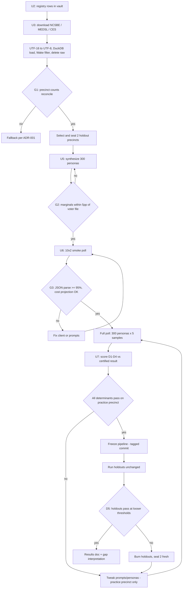

# feat: Wake County dress-rehearsal backtest with experiment tracking

Companion origin: `docs/brainstorms/2026-06-11-experiment-success-determinants-requirements.md` (success determinants D1–D5, tracking layer, loop protocol).

## Summary

Build and run Jefferson's first validation experiment: a static backtest of one Wake County NC precinct against its certified Nov-2020 result, executed as an iterate-until-pass loop governed by the D1–D5 success determinants, with an experiment tracker and monitoring dashboard built before any LLM spend. The pipeline runs on the ba-sing-se VPS with DuckDB as the warehouse; vault artifacts (four ADR drafts, research files, registry rows, competitive-landscape update) land alongside.

---

## Problem Frame

The architecture rethink (T9) ruled that the cheapest decisive experiment — can prompted off-the-shelf agents reproduce one known election result? — runs before any training, replay, or planner work. Competitor research then showed the loop form needs hard stop conditions and an anti-overfitting holdout rule, and that no tracking layer exists to record iterations. The backend code is currently broken (malformed packaging, mangled LLM client), so repair is on the critical path.

---

## High-Level Technical Design

Every POLL→SCORE cycle writes one run record to the tracker (U4) regardless of outcome. The loop's only exits: all determinants pass, budget ceiling hit, or human stop.

---

## Requirements

**Pipeline**

- R1. One command in `backend/` runs the full backtest end to end on the ba-sing-se VPS, in jose-owned paths, no sudo.
- R2. DuckDB is the warehouse; the existing Supabase persistence is bypassed, not refactored.
- R3. Every dataset has a vault data-registry row (license, PII, provenance, storage — including NC's commercial-use prohibition) before download.
- R4. The raw statewide voter file is deleted after the Wake filter; no name, address, or phone ever enters a prompt, a warehouse output, or the vault.
- R5. Poll prompts anchor the persona to November 2, 2020; no live news or post-2020 context is injected.

**Tracking layer (built before LLM spend)**

- R6. Every experiment run writes one record: run id, timestamp, git commit, prompt hash plus full prompt diff vs the previous run, model id, sample count, cost, all D1–D4 metric values, per-determinant pass/fail, notes.
- R7. A monitoring dashboard shows run history, metric trends across iterations, per-determinant status, and cumulative spend; design referenced against Mobbin metric-dashboard patterns.
- R8. The tracker and dashboard are operational before the first LLM-spending run.
- R9. The run-record schema is experiment-generic so future experiments (replay, diffusion, planner) reuse it.

**Determinants and loop protocol**

- R10. The loop's stop condition is the D1–D5 determinant set from the origin determinants doc: ≤4 pts two-party share error on the practice precinct (≤6 on holdouts), ≤8 pts weighted-mean subgroup error (no group >12), don't-know rate within 2× the CES rate and variance ≥ half CES variance, split-ticket direction reproduced, all while beating the uniform-swing and demographics-only baselines.
- R11. The loop tunes only on the practice precinct; the two sealed holdout precincts are never read, scored, or referenced until the pipeline is frozen.
- R12. Each iteration has a spend cap; the loop has a cumulative budget ceiling; hitting it stops the loop regardless of score.
- R13. Threshold changes after the loop starts require an ADR — the loop cannot move its own goalposts.
- R17. Geographic cues in prompts are fixed before the loop starts; tuning cannot add or alter place hints (extends R13's ADR rule to prompt geography).
- R18. A geography-masked diagnostic run (place names replaced with neutral descriptors) executes at freeze alongside the holdout exam and is reported in the results doc; informational, not pass/fail.
- R19. A failed holdout exam reclassifies those precincts as practice data; two fresh holdouts are drawn and sealed; after two burned pairs the experiment is declared failed.
- R20. The persona cohort seed is pinned across iterations (changes logged with rationale); a practice-precinct pass must replicate once with a fresh sampling seed before freeze.

**Vault artifacts**

- R14. Four ADR drafts land in the vault for Jose's signature: build-sequence amendment (v1 = snapshot + brute-force planner + replay-data prep, determinants as stop condition), planner Plan A (cached strategist + live check hybrid), analytics-agent foundation (skills-over-semantic-layer pattern), and an ADR-003 amendment (Qwen3-14B replaces the unavailable Qwen3-8B).
- R15. Research artifacts land per vault templates: GenMinds/RECAP (commentary thread folded in), QGF, the sentiment-keystone research brief, and a competitive-landscape update (SimSurveys, Aaru, Simile, Expected Parrot, Viewpoints, Verasight benchmarks).
- R16. The experiment produces a results doc with the measured gap, its interpretation, the masked-run comparison, the count of holdout exams taken, and links to the tracker run records; any claim derived from it is scoped as within-county, within-cycle validation.

---

## Key Technical Decisions

- **Qwen3-14B on DeepInfra** (`Qwen/Qwen3-14B`, $0.12/M in, $0.24/M out): Qwen3-8B is no longer served; 14B is the closest dense model and keeps the full run in the $1–3 envelope. Recorded as an ADR-003 amendment, not a silent swap.
- **Write a fresh async OpenAI-compatible DeepInfra client; do not repair `backend/src/tasks/llm.py`**: the existing file has a missing class statement, absent imports, and sync calls inside async functions that would serialize the whole poll. The `LLMClient` ABC and `LLM_PROVIDER` env-switch pattern are kept.
- **UTF-16 → UTF-8 conversion, Wake-filtered parquet, delete raw**: the NCSBE snapshot is UTF-16LE and ~3–5 GB uncompressed; DuckDB reads the converted file once, the Wake/precinct extract persists as parquet, and deleting the statewide raw is both the disk budget and the PII-retention story. Requires ~12 GB free and `PRAGMA memory_limit` + `temp_directory` set to jose-owned paths.
- **Collapsed subgroup reporting**: one-way margins (party, race, age, sex) plus a party×race two-way; the spec's full four-way grid is statistically empty at n=300. Cell list locked at G4's cell audit before scoring.
- **Turnout oracle with attrition gate**: individual voter history (`ncvhis92`) is the oracle only if its 2020 ballot count for the precinct is within 5% of the certified ballots cast; otherwise the pipeline auto-downgrades to precinct-aggregate turnout. The current-roll file silently loses voters who moved or died since 2020.
- **Stable persona keys, JSONL append, resume**: personas are seeded, persisted to parquet before polling, and every response carries (persona_idx, sample_idx, question_id); a crashed run resumes by replaying missing tuples. Unequal per-persona sample counts from silent failures would bias cells.
- **Structured output discipline**: thinking mode disabled (Qwen3 emits `<think>` blocks by default — breaks JSON and ~10× token cost), `response_format` JSON with enum-constrained choices, Pydantic validation, ≤2 retries per call, hard call-count ceiling.
- **Demographic mapping made explicit**: NCSBE `race_code` (incl. ~10–15% Undesignated) + separate `ethnic_code`, and party `UNA` (Wake's largest bloc) get first-class buckets in the persona model; CES NC crosstabs (state-level, weighted) impute the attitude and missing-demographic fields the voter file lacks.
- **Analytics foundation = skills-over-semantic-layer (proposed ADR)**: metric definitions live as DuckDB views + versioned markdown skill docs co-located with the transformation code in `backend/`, with a pre-commit check that data-model changes update their docs — the Anthropic internal pattern, which maps onto the existing vault + Meadow + Claude Code setup. The OpenAI pattern (standalone agent, nightly embedding index, memory service) is rejected for a solo operator at DuckDB scale.
- **Holdouts selected early and sealed**: one suburban and one rural Wake precinct chosen by ADR-001 criteria during U3 (while the data is open anyway), recorded in the tracker, and excluded from every later read until FREEZE.

---

## Implementation Units

### U1. Repair backend packaging and build the inference client

- **Goal:** `uv sync` works, imports are consistent, and a tested async DeepInfra client exists.
- **Requirements:** R1 (precondition), R5, R12.
- **Dependencies:** none.
- **Files:** `backend/pyproject.toml`, `backend/uv.lock`, `backend/src/tasks/llm_deepinfra.py` (new), `backend/src/utils/__init__.py`, import fixes across `backend/src/utils/*.py`, `backend/tests/test_llm_client.py` (new).
- **Approach:** Restore a valid `[project]` table with pinned deps (add `duckdb`, `openai`; align the zhipuai/zai mismatch by dropping unused providers), normalize all imports to `src.`-rooted, add a minimal pytest harness. New client implements the existing `LLMClient` ABC: async, OpenAI-compatible endpoint, JSON response format, no-think flag, retry ≤2, and a process-wide call counter that raises at the ceiling.
- **Test scenarios:** `uv sync` then `uv run pytest` passes clean; client returns validated JSON for a mocked response; a malformed response retries twice then records a failure (not an exception bubble); the call ceiling trips at N+1 with a clean error; concurrent `asyncio.gather` calls don't serialize (mock latency test).
- **Verification:** fresh clone + `uv sync` + tests pass locally and on the VPS.

### U2. Vault governance: data-registry rows

- **Goal:** all five datasets are registered before anything downloads (vault rule; R3).
- **Requirements:** R3, R4.
- **Dependencies:** none (parallel with U1).
- **Files:** vault `02-DATA/Data-Registry.md` (target repo: Jefferson vault, edited in a worktree per vault ops rules).
- **Approach:** One row each for VR_Snapshot_20201103, results_pct_20201103, ncvhis92, MEDSL precinct returns (CC0), CES 2020 (free Dataverse login). Each row: exact URL, license terms, PII flag (voter files: yes — names/addresses/phones present in raw; retention: raw deleted post-filter, aggregates only), provenance, storage location on VPS. NC commercial-use prohibition noted on every NCSBE row.
- **Test expectation: none** — doc-only unit; the vault frontmatter hook is the check.
- **Verification:** registry rows pass the vault pre-commit hook; every dataset URL in the rows matches the one the pipeline actually fetches.

### U3. Ingest to DuckDB, precinct reconciliation, holdout sealing

- **Goal:** Wake County Nov-2020 data queryable in DuckDB on the VPS; practice precinct verified; holdouts sealed.
- **Requirements:** R1, R2, R3 (gate), R4.
- **Dependencies:** U1, U2. CES download is a manual step (Dataverse login) — kick it off first.
- **Files:** `backend/src/flows/backtest_ingest.py` (new), `backend/src/tasks/warehouse.py` (new), `backend/tests/test_ingest.py` (new), `backend/data/` layout conventions.
- **Approach:** Disk preflight (≥12 GB free); download NCSBE files; `iconv` UTF-16→UTF-8; DuckDB with `memory_limit` and `temp_directory` pragmas; filter to Wake; write parquet extracts; delete statewide raw. G1 gate: practice precinct exists with ~2.5–4k registrants, snapshot/results/history counts reconcile after `ncid` join, no pseudo-precinct (ABSENTEE/ONESTOP/PROVISIONAL) rows hold unallocated Wake votes, attrition check decides the turnout oracle. Select and record the two holdout precincts, then exclude them from all subsequent queries.
- **Test scenarios:** UTF-16 fixture file round-trips correctly; Wake filter returns only `county_desc='WAKE'`; G1 reconciliation passes on fixture data and fails loudly on a seeded mismatch; attrition gate downgrades the oracle when fixture history is eroded >5%; raw-file deletion happens only after parquet checksums verify; holdout precincts are absent from every downstream query result.
- **Verification:** G1 report prints precinct id, registrant count, certified ballot count, oracle decision, and sealed holdout ids; raw statewide files no longer on disk.

### U4. Experiment tracker and monitoring dashboard

- **Goal:** every run is recorded and watchable before any LLM spend.
- **Requirements:** R6, R7, R8, R9.
- **Dependencies:** U1 (packaging), U3 (DuckDB exists). Blocks U6/U7.
- **Files:** `backend/src/tracking/runs.py` (new), `backend/src/tracking/schema.sql` (new), `backend/dashboard/` (new — generator + static assets), `backend/tests/test_tracking.py` (new).
- **Approach:** `runs` table keyed by run id with the R6 fields plus experiment id (generic for future experiments); thin append/read API the loop and scorer call; dashboard as a static page regenerated after each run and served from a jose-owned VPS path — run table, metric-vs-iteration trend charts, determinant status row, cumulative spend. Pull 3–5 metric-dashboard references from Mobbin before layout; keep the page dependency-free (inline JS/CSS).
- **Test scenarios:** record write→read round-trip preserves all fields; a second run for the same experiment appends rather than overwrites; determinant status computed correctly from stored metrics for pass, fail, and missing-metric cases; dashboard generator produces valid HTML from a fixture run set; cumulative spend sums across runs.
- **Verification:** dashboard renders fixture history in a browser; an end-to-end dry-run record (no LLM) appears on it.

### U5. Persona synthesis from voter file + CES conditioning

- **Goal:** ~300 seeded personas matching the practice precinct's Nov-2020 registered population.
- **Requirements:** R4, R10 (G2 gate).
- **Dependencies:** U3.
- **Files:** `backend/src/flows/persona_synthesis.py` (new), `backend/src/models/persona.py` (extend enums: party UNA, race Undesignated, ethnicity), `backend/src/utils/persona_generator.py` (adapt), `backend/tests/test_persona_synthesis.py` (new).
- **Approach:** Stratified sample of the precinct's registrant demographics (party × race × age × sex from the snapshot); CES 2020 NC subsample (weighted, `inputstate==37`) imputes issue positions and the demographic fields the voter file lacks (income, education, employment, marital). No name/address fields ever read into the persona model. Personas persisted to parquet with stable `persona_idx` before any polling. G2 gate: persona marginals within 5pp of voter-file marginals on every one-way margin.
- **Patterns to follow:** existing `Persona.to_prompt()` and `PrecinctConfig` shapes; `PersonaGenerator` stratification logic.
- **Test scenarios:** marginals of a generated cohort match a fixture precinct within tolerance; same seed → identical cohort; UNA and Undesignated buckets appear in proportion; no PII columns present in the persona parquet schema; CES imputation draws respect CES weights (distribution test on a fixture).
- **Verification:** G2 report prints side-by-side marginals; persona parquet committed to the warehouse, hash recorded.

### U6. Polling engine

- **Goal:** poll all personas (N≥5 samples each) with resumable, cost-guarded, time-anchored calls.
- **Requirements:** R5, R10, R12.
- **Dependencies:** U1, U4, U5.
- **Files:** `backend/src/flows/backtest_poll.py` (new), `backend/tests/test_poll_flow.py` (new).
- **Approach:** Adapt the existing batched `asyncio.gather` poll-flow skeleton: per-call (persona_idx, sample_idx, question_id) keys, JSONL append per response, resume by replaying missing tuples. Questions: turnout intent, presidential choice, gubernatorial choice, short issue battery — enum-constrained options including "don't know / prefer not to say". Prompt anchors "today is November 2, 2020" and contains zero post-2020 information; the legacy live-news injection path is not called. G3 smoke gate: 10 personas × 2 samples — parse rate ≥95%, projected full-run cost within cap.
- **Test scenarios:** mid-run kill + restart produces exactly the missing tuples and no duplicates; per-persona sample counts equal after a run with injected transient failures; a persona whose calls all fail is flagged, not silently dropped; prompt snapshot contains no string matching post-2020 entities (fixture check); cost projection math matches token accounting on a mocked run.
- **Verification:** G3 report (parse rate, latency, projected cost) recorded to the tracker; full run produces 300×5 response sets with equal counts.

### U7. Scoring, baselines, and determinant evaluation

- **Goal:** compute D1–D4 metrics, compare against baselines, write the run record.
- **Requirements:** R10, R6, R16.
- **Dependencies:** U3 (certified results, oracle), U4, U6.
- **Files:** `backend/src/flows/backtest_score.py` (new), `backend/src/tasks/metrics.py` (new), `backend/tests/test_metrics.py` (new).
- **Approach:** Aggregate response distributions per persona (not modal answers); weight by turnout oracle (per U3's gate decision) and by modeled turnout as a second variant; score the collapsed cell set (G4 cell audit locks cells with n≥20 first); compute D1 (two-party share error vs certified), D2 (weighted-mean and max subgroup error), D3 (don't-know rate vs CES, variance floor vs CES cell variance), D4 (split-ticket direction); bootstrap CIs over personas and samples. Baselines: uniform swing from the precinct's 2016 result, demographics-only multinomial logit fit on CES NC. Frontier-API reference run deferred to follow-up. Scorer writes the complete run record (R6) and per-determinant pass/fail.
- **Test scenarios:** metrics reproduce hand-computed values on a tiny fixture electorate; oracle vs modeled weighting produce different (both recorded) results; a variance-collapsed fixture (all personas identical answers) fails D3; a fixture with inverted split-ticket fails D4; baseline-beating logic requires beating BOTH baselines; bootstrap CI coverage flag computed correctly when the certified value sits inside/outside the interval.
- **Verification:** one command scores a stored response set and the new row appears on the dashboard with determinant statuses.

### U8. Vault knowledge artifacts

- **Goal:** ADR drafts, research files, keystone brief, and landscape update ready for Jose's sign-off.
- **Requirements:** R14, R15.
- **Dependencies:** none (parallel; references U-series outcomes only in the ADR-003 amendment, which cites the model swap from this plan).
- **Files:** vault (worktree): `01-ARCHITECTURE/ADRs/ADR-004-*.md`, `ADR-005-*.md`, `ADR-006-*.md`, ADR-003 amendment; `05-RESEARCH/` paper files per PAPER-TEMPLATE (GenMinds/RECAP, QGF); sentiment-keystone brief; `04-PRODUCT/Jefferson-Competitive-Landscape.md` update.
- **Approach:** ADRs follow the vault template, status `proposed`; standing decisions change only via these. Landscape update adds SimSurveys, Aaru (incl. 2024 misses), Simile, Expected Parrot, Viewpoints, Verasight benchmark numbers, and the "empty precinct-level lane" finding with sources.
- **Test expectation: none** — doc-only unit; vault frontmatter hook + ADR template are the checks.
- **Verification:** vault pre-commit passes; PROJECT.md open-threads table updated to point at the proposed ADRs.

### U9. One-command orchestration, VPS deploy, loop protocol, holdout exam

- **Goal:** the whole pipeline runs as one command on the VPS; the loop iterates under protocol; holdouts decide the verdict.
- **Requirements:** R1, R11, R12, R13, R16.
- **Dependencies:** U1–U7.
- **Files:** `backend/src/cli.py` (add `backtest` command group: `ingest`, `personas`, `poll`, `score`, `run-all`, `holdout`), `backend/deploy/sync.sh` (new — rsync to ba-sing-se, jose-owned path), `backend/tests/test_cli_backtest.py` (new).
- **Approach:** CLI subcommands compose U3/U5/U6/U7 flows with the gates enforced between stages; `run-all` halts at any failed gate. Loop protocol: tuning iterations modify prompts/persona-conditioning only, each iteration is a tracked run, practice precinct only (holdout queries blocked until a `--frozen <tag>` flag); on practice pass, tag the commit, run `holdout` against both sealed precincts with zero changes; results doc generated from tracker records with the gap interpretation skeleton.
- **Test scenarios:** `run-all` stops at a seeded G1 failure with a non-zero exit and a tracker record; holdout command refuses to run without a frozen tag; holdout command refuses if the working tree differs from the tag; budget ceiling aborts mid-poll and the partial run is resumable; results doc generator includes every tracked run for the experiment.
- **Verification:** end-to-end dry run (mocked LLM) on the VPS from one command; real run executes tonight's sequence G1→G4.

---

## Scope Boundaries

- **Deferred to follow-up work:** frontier-API reference baseline; secondary-precinct expansion beyond the two holdouts; the MVP plan (replay pipeline build-out, diffusion, hybrid planner implementation, voter fine-tuning) — written after this experiment's result per the origin doc; full-population (agent-per-registrant) simulation — composites only until the diffusion rung; determinants for future experiments (schema accommodates them now).
- **Non-goals:** refactoring the Supabase/news-scraper code paths; the campaign-facing product UI (the dashboard is internal); any real-voter contact (phone fields are never read; polling real people is the sentiment-keystone thread with its own legal guardrails); any public accuracy claim before D5 passes.

---

## Risks & Dependencies

- **CES download is login-gated** (free Dataverse account): manual step, do it first; pipeline takes the file path as input rather than automating the download.
- **Practice precinct identity**: ADR-001's "01-07" must survive G1 reconciliation; fallback criteria (mid-size Raleigh precinct, 2.5–4k voters) are in ADR-001, and Mecklenburg-2024 is the named escape hatch if Wake data fails structurally.
- **Model knowledge leakage**: Qwen3-14B knows the 2020 outcome; the Nov-2 anchor and zero-context prompts reduce but cannot eliminate this. Recorded as a known limitation in the results doc — it biases *toward* passing, which is another reason D5 (holdouts) is the bar that matters.
- **VPS resources**: ~12 GB disk transiently, DuckDB memory pragmas required; check before download, not after.
- **NC commercial-use prohibition on voter data**: fine for internal R&D; flagged in registry rows and must resurface in any future productization decision.
- **Schedule**: "tonight" (now: this session) holds only if G1 passes quickly; every gate failure has a named fallback rather than an improvised one.

---

## Sources & Research

- Origin docs: `docs/brainstorms/2026-06-10-jefferson-architecture-rethink-requirements.md`, `docs/brainstorms/2026-06-11-experiment-success-determinants-requirements.md`.
- Vault (decisions this plan implements): `03-MODELS/Backtest-Spec.md`, `01-ARCHITECTURE/ADRs/ADR-001..003`, `04-PRODUCT/Jefferson-Competitive-Landscape.md` — vault-relative paths.
- Verified data endpoints (2026-06-11): `https://s3.amazonaws.com/dl.ncsbe.gov/data/Snapshots/VR_Snapshot_20201103.zip` (~1.05 GB, UTF-16LE TSV); `https://s3.amazonaws.com/dl.ncsbe.gov/ENRS/2020_11_03/results_pct_20201103.zip` (~5 MB); `https://s3.amazonaws.com/dl.ncsbe.gov/data/ncvhis92.zip` (Wake voter history); MEDSL `doi:10.7910/DVN/K7760H` (CC0); CES 2020 `doi:10.7910/DVN/E9N6PH` (free login). Layout files: `layout_VR_Snapshot.txt`, `layout_results_pct.txt` on the same host.
- Model pricing (2026-06-11): DeepInfra `Qwen/Qwen3-14B` $0.12/M in, $0.24/M out; Qwen3-8B not served.
- Reusable code: `backend/src/models/persona.py` (Persona + to_prompt), `backend/src/utils/persona_generator.py`, `backend/src/flows/simulation.py` (batched gather skeleton), `backend/src/cli.py` (Click patterns). Known-broken: `backend/pyproject.toml`, `backend/src/tasks/llm.py` (replace, don't repair).
- Industry benchmarks grounding the determinants: Verasight synthetic-sampling white paper (4-pt avg / 8-pt subgroup); SimSurveys published thresholds (KL<0.10, JS<0.05); failure-mode literature (arXiv:2507.02919 variance collapse, arXiv:2405.06058 social desirability).
